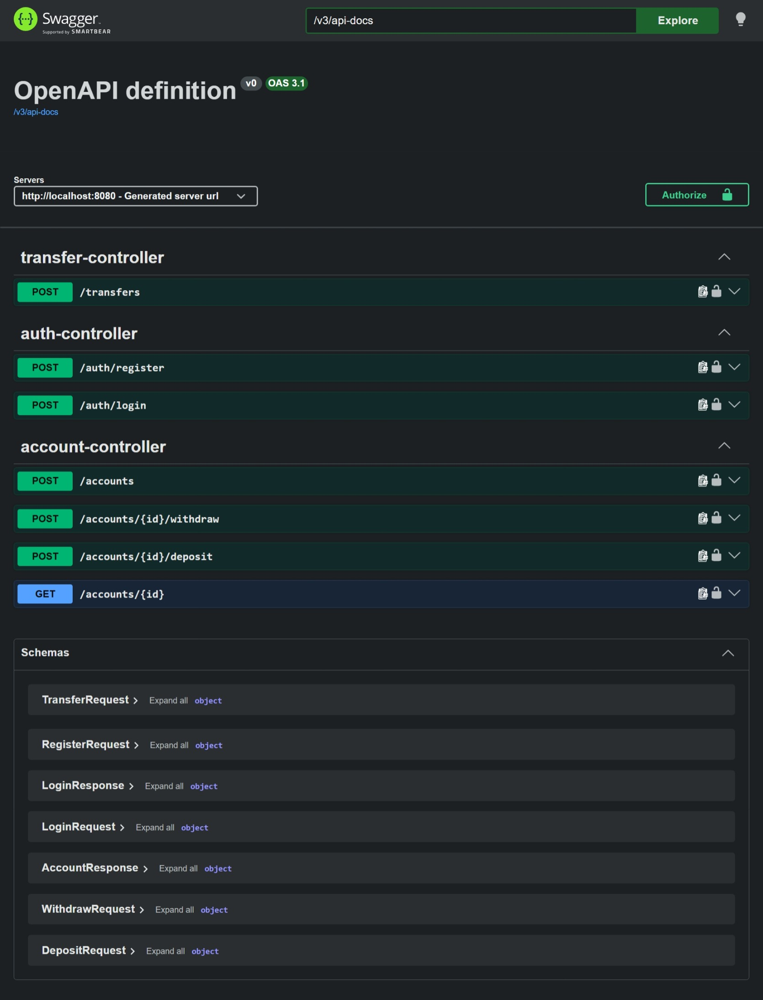

# E-Wallet Service

A mini electronic wallet REST API built with Spring Boot, supporting concurrency-safe deposits, withdrawals, and transfers between accounts, with JWT authentication and role-based access control.

## How to run the project

### Prerequisites

- Java 17+
- Maven (or use the included `./mvnw`)
- Docker and Docker Compose if you want to run the full stack containerized

### Running with Docker

```bash
docker compose up --build
```

This starts both the Spring Boot app and PostgreSQL. The app runs on `http://localhost:8080` and Postgres is available on `localhost:5432`.

### Running locally

```bash
./mvnw spring-boot:run
```

This mode expects a PostgreSQL database running on `localhost:5432` with the credentials from `src/main/resources/application.properties`.

You can also set the runtime values through environment variables instead of editing the file directly, for example:

```bash
export JWT_SECRET="your-jwt-secret"
export SPRING_DATASOURCE_URL="jdbc:postgresql://localhost:5432/ewallet"
export SPRING_DATASOURCE_USERNAME="user"
export SPRING_DATASOURCE_PASSWORD="password"
```

- API docs (Swagger UI): `http://localhost:8080/swagger-ui/index.html`
  

### Running tests

```bash
./mvnw test
```

Tests run against an isolated in-memory H2 database (`application-test.properties`), never against the real Postgres instance. Coverage includes:

- Concurrency correctness under simultaneous operations (`ConcurrencyTest`)
- Failure paths for deposit/withdraw/transfer — insufficient balance, blocked accounts, self-transfer rejection (`FailurePathTests`)
- Deferred processing — audit log entries are only created for successfully committed operations, never for failed ones (`TransactionEventListenerTest`)
- Authorization — a user cannot read or write another user's account; an admin can read any account but cannot write to one they don't own (`AccountAuthorizationIntegrationTest`)

### Getting started

Accounts are not seeded automatically. To create one:

```bash
# 1. Register a user
curl -X POST http://localhost:8080/auth/register \
  -H "Content-Type: application/json" \
  -d '{"username": "alice", "password": "yourpassword"}'

# 2. Use the returned token to create an account for yourself
curl -X POST http://localhost:8080/accounts \
  -H "Authorization: Bearer <token>"
```

Admin accounts are not self-service; they're created by inserting a row with `role = ADMIN` directly into the `users` table.

## Architecture

Standard layered architecture:

- **`controller/`** — HTTP concerns only (request/response mapping)
- **`service/`** — business logic
- **`repository/`** — data access (Spring Data JPA)
- **`entity/`** — database-mapped models
- **`dto/`** — API-facing request/response shapes, kept separate from entities
- **`exception/`** — custom exceptions + a centralized `GlobalExceptionHandler` for consistent error responses
- **`event/`** — deferred processing (audit logging, notifications), decoupled from business logic via Spring's event system
- **`config/`** — security setup (JWT filter, authorization rules)

### Key design decisions

**Concurrency.** Deposits, withdrawals, and transfers all use pessimistic row-level locking (`SELECT ... FOR UPDATE` via `@Lock(PESSIMISTIC_WRITE)`), rather than optimistic locking (`@Version`). Wallet operations are write-heavy on potentially "hot" accounts, and correctness matters more here than raw read throughput — pessimistic locking guarantees correctness directly, with no client-side retry logic needed. For transfers, which lock two accounts at once, locks are always acquired in a fixed order (the lower account ID first), regardless of which account is the source and which is the destination for that particular request. This prevents the classic deadlock scenario where two opposite transfers (A→B and B→A) each hold one lock and wait indefinitely on the other. This is proven by `ConcurrencyTest`, which fires real concurrent threads at the same accounts and asserts the final balances are correct, plus a timeout-based check that opposing transfers never deadlock.

**Deferred processing (audit logging + notifications).** Implemented via Spring's `ApplicationEventPublisher` and `@TransactionalEventListener(phase = AFTER_COMMIT)`, combined with `@Async`. This achieves three things: the listener is fully decoupled from the transactional business logic (`AccountService`/`TransferService` never call audit or notification code directly — they only publish an event through `TransactionRecorder`); the listener only fires after the database transaction has actually committed, so a failed or rolled-back operation can never trigger an audit entry or notification for something that didn't really happen; and `@Async` runs the listener on a separate thread, so it never blocks the HTTP response. Failed operations (insufficient balance, blocked account) are still recorded as `FAILED` rows in the `transactions` table — via a separate `REQUIRES_NEW` transaction, so the record survives even though the enclosing operation rolls back — but deliberately do not trigger an audit log entry or notification."

**Authentication & authorization.** JWT-based, stateless (no server-side sessions) — the token itself carries the username and role, verified fresh on every request via `JwtAuthFilter`. A standard user can only read or write their own accounts; an admin has global **read-only** access, matching the spec exactly — admins cannot deposit, withdraw, or transfer on behalf of other users. This split (`canRead` vs `canWrite`) is enforced via `@PreAuthorize` backed by a dedicated `AccountSecurity` bean, and verified end-to-end by `AccountAuthorizationIntegrationTest`, which makes real HTTP requests with real tokens across two separate users.

**Error handling.** A `GlobalExceptionHandler` (`@RestControllerAdvice`) catches all domain exceptions and returns a consistent JSON error shape (`timestamp`, `status`, `error`, `message`, `path`) instead of raw stack traces, with status codes chosen deliberately: `404` for a missing account, `422` for a request that's well-formed but can't be completed (insufficient balance, blocked account), `400` for malformed input, `401`/`403` for authentication and authorization failures.

**Self-transfer rejection.** During testing, transferring an account to itself was found to silently succeed: because both "source" and "destination" resolve to the same JPA-managed entity within one transaction, subtracting and then re-adding the same amount to the same object cancels out — the balance ends up unchanged, but a `TRANSFER` transaction row and a notification would still fire for an operation that had no real effect. This is now explicitly rejected with a `400` before any locking happens.

## Trade-offs and things I'd do differently with more time

- **`AuditLog` and `Transaction` overlap.** The two tables currently store largely overlapping data. In a larger system I'd differentiate them more clearly — e.g. `AuditLog` capturing data that `Transaction` doesn't have/need, rather than duplicating the same financial fields in both places.
- **Transactional outbox instead of `@TransactionalEventListener` + `@Async`.** The current approach is correct and simple for a single instance, but not fully durable: if the app crashed between a transaction committing and the async listener actually running, the audit entry or notification would be silently lost. A transactional outbox (write an "event to publish" row in the same transaction as the business change, with a separate poller publishing it) would be more robust, and is also what I'd reach for if this ran on multiple instances.

- **Distributed locking for multiple instances.** The current pessimistic locking is correct on multiple instances as-is, since the database remains the single source of truth regardless of which instance a request lands on. Under heavy multi-instance load, a distributed lock (e.g. Redis) could reduce contention and timeout risk.
- **Refresh tokens.** JWTs currently just expire after 60 minutes with no renewal flow; a refresh-token mechanism would be needed for a real client application.
- **Real notification delivery.** Currently simulated via a log line, as explicitly permitted by the test's spec; a real system would integrate an actual email/SMS/push notification.
- **Rate limiting and account lockout.** Neither `/auth/login` nor `/auth/register` currently has any rate limiting or lockout after repeated failed attempts — a reasonable addition for a public-facing financial API.
